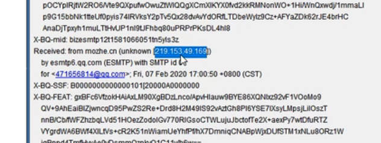
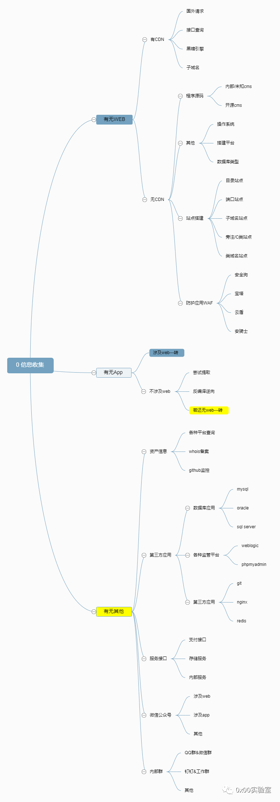
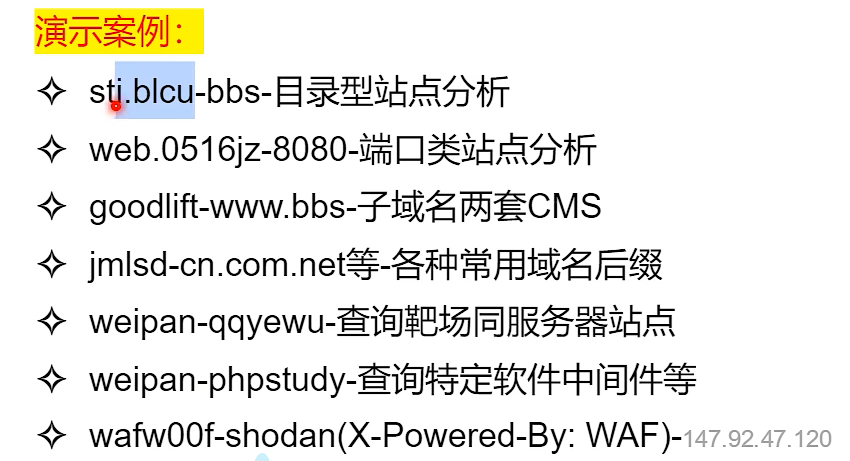

## CDN相关技术

**CDN是什么？CDN对安全渗透有何影响？**

CDN (Content Delivery Network) 是一种将网络内容分布到多个地理位置的技术。当用户访问网站时，CDN 会将数据从最近的服务器节点传递给用户，从而加快网站的加载速度。

CDN 技术对于安全渗透的影响，具体如下：

1. 防御 DDoS 攻击： CDN 可以通过分布式网络架构来缓解 DDoS 攻击，因为攻击者需要同时针对多个节点发起攻击才能影响网站的可用性。
2. 缩短攻击链： CDN 会将网站的内容存储在多个地理位置，因此攻击者需要绕过更多的网络跳转才能到达目标网站，这可能会使攻击者更难找到入口。
3. 强制加密： CDN 一般提供了HTTPS 加密协议，这可以防止中间人攻击，并且可以防止攻击者拦截并篡改数据。
4. 保护敏感信息： CDN 一般都有加密和隐私保护的措施来保护敏感信息，如防止跟踪和收集用户的数据。

然而，CDN技术也有它自身的风险，比如一些CDN服务商可能会将数据存储在不安全的地方，或者CDN服务商自己可能会被黑客攻击，使得数据泄露。所以需要选择合适的CDN服务商并且经常审计和监控。

**判断某个站点是否使用了CDN技术**

1. 检查 IP 地址: 使用命令行工具 "nslookup" 或者 "dig" 查询网站的 IP 地址，如果返回多个 IP 地址，则可能使用了 CDN。
2. 检查 HTTP 响应头: 可以使用工具如curl,wget等来检查响应头，如果看到有"Via"或者"Server"头部，这说明使用了CDN。
3. 查看DNS记录: 通过查看DNS记录来判断， 如果该网站域名解析出多个IP地址则说明使用了CDN
4. 使用第三方工具：也可以使用第三方工具如WhatIsMyIPAddress , CDN Detector等来检测某个网站是否使用了CDN
5. 手动检查：也可以通过不同地理位置请求该网站并对比响应时间和内容来判断是否使用了CDN

**如何绕过CDN，找到目标网站真实IP**

1. 子域名查询：有的网站主域名会做CDN，但是子域名可能不会做，因此可以先获取子站的IP，进而推出主站（因为通常在一个网段）。
2. 邮件服务查询：我们访问别人，可能通过CND，但别人访问我们通常不会走CDN，所以我们可以通过对方发来的邮件IP来推断主站IP，同样是有可能在同一个网段。
3. 使用国外地址请求：国外没有cdn节点的话，可能直接走原IP
4. 遗留文件，扫描全网
5. 黑暗引擎搜索特定文件
6. dns历史记录，以量打量：CDN节点是有流量上限的，用光之后就会直通原机，这也是一种流量攻击

**各网站查询真实IP例子**

- 二级域名和三级域名查到的结果可能不一样

  > xueersi.com（没有使用CDN） 和 www.xueersi.com
  >
  > 在用户实际访问的时候，用户在浏览器中输入xueersi.com，浏览器会自动加上前缀www，因此大多数人都是通过www.xueersi.com来访问网站的。
  >
  > 本质上，这两者在DNS中是不同的记录，因此解析方式不同，进而导致两者都设置CDN则成本更高，所以一些企业会选择只给 www.example.com 配置CDN

- 主域名和子域名查询到的可能不一样

  > m.sp910.com sp910.com

- 第三方接口(接口查询)

  > [Get Site IP - Find IP Address and location from any URL (get-site-ip.com)](https://get-site-ip.com/?com=qb&id=1003&action=open)

- 国外请求( 同类型访问)

- 邮件源码测试对比第三方查询

  > 让对方主动发邮件（注册账号时的邮箱验证码、邮件寻求人工帮助等）
  >
  > 查看邮件的源码，找到发件方的IP
  >
  > 
  >
  > （需要注意，找到的是QQ邮箱IP还是目标网站的IP）
  >
  > 根据网站的备案号、公司地址人文因素等找到真实IP
  >
  > 确定猜想：本地修改DNS并清理浏览器缓存，如果能打开，大概率是真实IP

- 黑暗引擎搜指定hash文件

- 扫全网fuckcdn，w8 fuckcdn，zmap等（这个方法不推荐）

## 架构、搭建、WAF等

**站点搭建分析**

> 寻找多个目标

- 目录型站点

- 端口类站点

- 子域名站点

- 类似域名站点

- 旁注, c段站点

  旁注：同服务器不同站点

  C段：不同服务器不同站点 同网段

  > 工具：[同IP站点](https://www.webscan.cc/)

- 搭建软件特征站点

**WAF防护分析**

- 什么是WAF应用? --  Web应用防护系统（也称为：网站应用级入侵防御系统。英文：Web Application Firewall，简称：WAF）。

- 如何快速识别WAF?

  > 工具 [wafw00f](https://github.com/EnableSecurity/wafw00f)

- 识别WAF对于安全测试的意义?

  找到管理后台

  > 宝塔 8888
  >
  > phpmyadmin

 

## APP及其他资产

### APE提取一键反编译提取

- 使用反编译工具，尝试获取包了里的源码，逆向出网址，进而转为web渗透

### APP抓数据包进行工具配合

- 使用burp suite设置代理，或者wireshark抓数据包，进行分析，同样是找出网址

找出网址后就可以一通乱扫，用黑暗引擎或者nmap进行端口扫描

观察黑暗引擎的搜索结果，观察不同的报文，点开相应的端口，可能可以进入管理后台，也可以在网址上添加探针目录（robots.txt phpinfo ），看看是否能获取到更多信息

## 资产监控拓展

1. Github监控 -- 便于收集整理最新exp或poc -- 便于发现相关测试目标的资产
2. 子域名挖掘机
