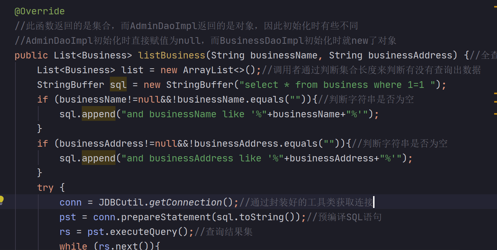

1. jdbc学习

   1. 注册驱动

      1. 告诉java程序即将连接哪个品牌的数据库
      2. 使用了资源绑定器绑定属性配置文件bundle.getString("DRIVER");

   2. 获取连接

      1. 表示JVM的进程和数据库进程之间的通道打开了，属于进程之间的通信。消耗大，使用完必须关闭

   3. 获取数据库对象

   4. 执行SQL

      1. 有两种方法：statement和preparedstatement

         1. | preparedstatement            | statement                                               |
            | :--------------------------- | ------------------------------------------------------- |
            | 编译一次执行多次，效率更高   | 编译一次执行一次                                        |
            | 解决SQL注入问题              | 存在SQL注入问题                                         |
            | 会在编译阶段做类型的安全检查 |                                                         |
            | 大多数情况都用预编译         | 需要进行SQL语句拼接的时候才用（例如：商城的升序和降序） |

      2. SQL注入 

         > sql语句：` select * from user where loginName = '"+loginName+"' and loginPwd = '"+loginPwd+"'` 
         >
         > 用户名： fdss
         >
         > 密码：fdss' or '1'='1

      3. 在多条件模糊查询的时候，如何确定SQL语句

         > 就是在查询商家的时候可以按商家名称也可以按地址查询，这两种SQL语句怎么确定？
         >
         > string和StringBuffer的选择
         >
         > 

   5. 处理查询

      1. 不同的SQL语句查询方法不一样

         > 在jdbc中3种执行sql的语句execute，executeQuery和executeUpdate的区别？
         >
         > > - execute执行增删改查操作
         > >
         > > execute返回的结果是个boolean型，当返回的是true的时候，表明有ResultSet结果集，通常是执行了select操作，当返回的是false时，通常是执行了insert、update、delete等操作。execute通常用于执行不明确的sql语句。
         > >
         > > - executeQuery执行查询操作
         > >
         > > executeQuery返回的是ResultSet结果集，通常是执行了select操作。
         > >
         > > - executeUpdate执行增删改操作
         > >
         > > executeUpdate返回的是int型，表明受影响的行数，通常是执行了insert、update、delete等操作。

   6. 释放连接

2. 命名规范

3. dao po view 分层设计
